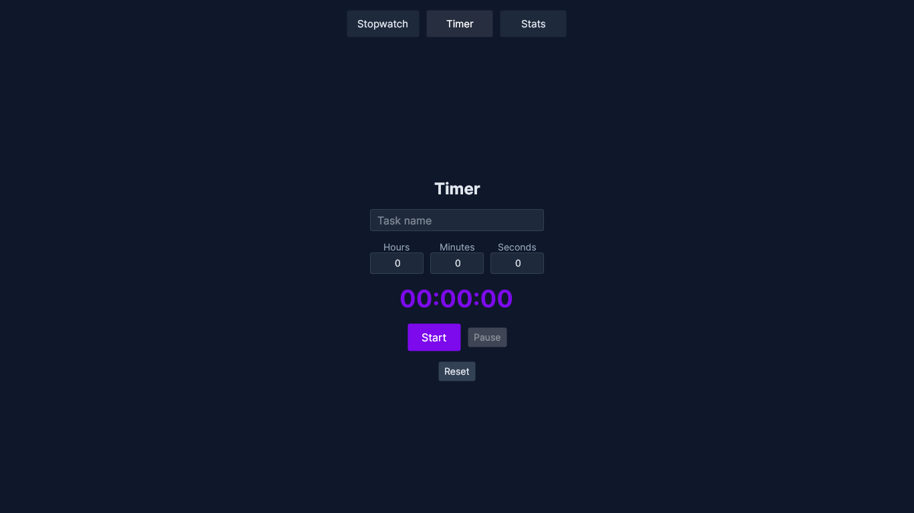
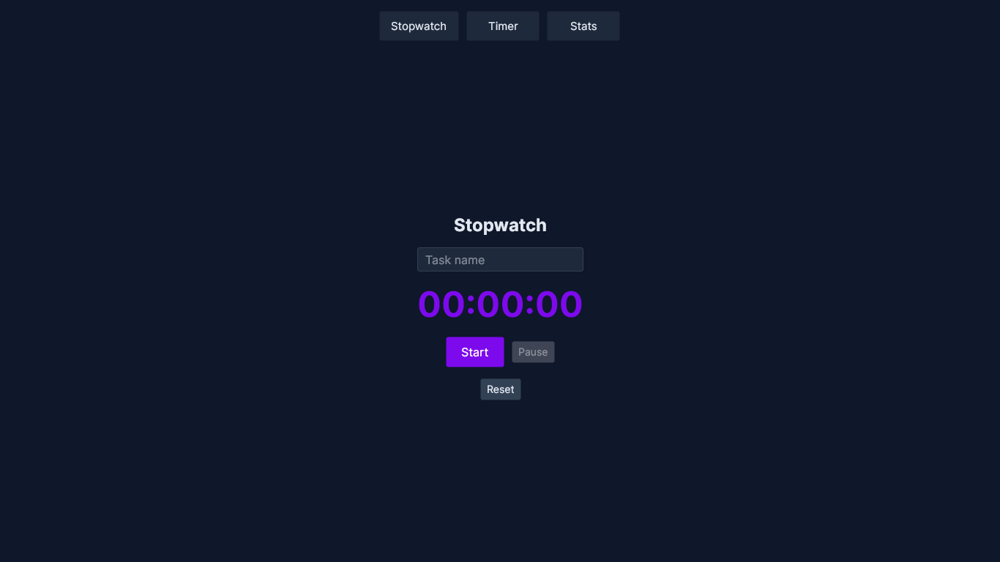
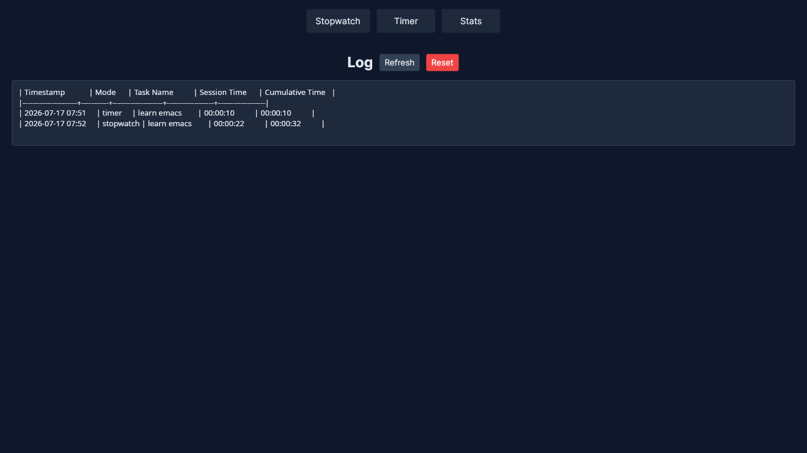

* TimeTrace

A simple cross-platform desktop time-tracking application built with .NET 8 and Avalonia UI.

** Features

- *Countdown Timer* — Set hours/minutes/seconds for a named task, count down with live display. Auto-saves on completion, plays audio alert (timer-sound.mp3). Manual Stop saves partial elapsed time.
- *Stopwatch* — Count up from zero for a named task. Stop saves the elapsed duration.
- *Log Viewer* — View the full pipe-delimited log file in a read-only text box. Refresh or reset all data.

** Tech Stack

- *Language:* C# (.NET 8.0)
- *UI Framework:* Avalonia UI 11.3.12
- *MVVM Toolkit:* CommunityToolkit.Mvvm 8.2.1 (source generators: [ObservableProperty], [RelayCommand])
- *Theme:* Custom dark theme (slate navy + purple accent)
- *Platform:* Windows, Linux, macOS
- *Build:* dotnet build / dotnet run / dotnet publish -c Release

** Prerequisites

- .NET 8.0 SDK

** Install

Clone and build:

#+BEGIN_EXAMPLE
git clone <url>
cd TimeTrace
dotnet build -c Release
#+END_EXAMPLE

Run directly:

#+BEGIN_EXAMPLE
dotnet run --project TimeTrace
#+END_EXAMPLE

Publish a platform-specific self-contained binary:

#+BEGIN_EXAMPLE
dotnet publish -c Release -r <RID> --self-contained
#+END_EXAMPLE

Replace =<RID>= with your runtime identifier (e.g. =win-x64=, =linux-x64=, =osx-x64=).

** How to Use

*** Timer

1. Enter a task name
2. Set hours, minutes, and seconds
3. Click *Start* to begin countdown
4. Auto-saves when complete, or click *Stop* to save elapsed time
5. "Timer finished!" message + audio alert on completion

*** Stopwatch

1. Enter a task name
2. Click *Start* to begin timing
3. Click *Stop* to save the elapsed time

*** Log

- Raw view of the pipe-delimited log file with Refresh / Reset buttons
- Reset clears all data permanently

** Data Storage

Time entries are persisted to =~/magnus/timetrace/timetrace.log= in a pipe-delimited table format:

| Timestamp            | Mode      | Task Name          | Session Time      | Cumulative Time   |
|----------------------+-----------+--------------------+-------------------+-------------------|
| 2026-07-17 07:51     | timer     | learn emacs        | 00:00:10          | 00:00:10          |

Each entry records: timestamp, mode (timer/stopwatch), task tag, session duration, and cumulative duration for that tag.

** Project Structure

#+BEGIN_EXAMPLE
TimeTrace/
├── Program.cs                    # Application entry point
├── App.axaml / App.axaml.cs      # App config, theme styles (dark palette), ViewLocator registration
├── ViewLocator.cs                # ViewModel → View resolution by naming convention
├── app.manifest                  # Windows DPI manifest
├── TimeTrace.csproj              # .NET 8 project, Avalonia 11.3.12, CommunityToolkit.Mvvm 8.2.1
├── timer-sound.mp3               # Audio alert on timer completion
├── .gitignore
├── Models/
│   └── TimeEntry.cs              # Data model (Timestamp, Mode, Tag, SessionSeconds, CumulativeSeconds)
├── Services/
│   └── TimeService.cs            # File I/O for pipe-delimited log persistence, cumulative time calculation
├── Helpers/
│   └── SoundHelper.cs            # Cross-platform sound player (powershell/afplay/paplay/aplay)
├── ViewModels/
│   ├── ViewModelBase.cs          # Base class (ObservableObject)
│   ├── MainWindowViewModel.cs    # Navigation: Timer / Stopwatch / Stats sub-views via ContentControl
│   ├── TimerViewModel.cs         # Countdown timer logic with timer snapshot on start
│   ├── StopwatchViewModel.cs     # Stopwatch (elapsed) logic
│   └── StatsViewModel.cs         # Raw log load/reset
└── Views/
    ├── MainWindow.axaml / .cs    # Main window with nav buttons and ContentControl
    ├── TimerView.axaml / .cs     # Timer UI (NumericUpDown, Start/Stop/Reset)
    ├── StopwatchView.axaml / .cs # Stopwatch UI (Start/Stop/Reset)
    └── StatsView.axaml / .cs     # Log viewer (read-only TextBox, Refresh/Reset)
#+END_EXAMPLE

** Architecture

TimeTrace follows the *MVVM (Model-View-ViewModel)* pattern:

- *Models* — Data structures (TimeEntry)
- *Views* — Avalonia XAML files with compiled bindings
- *ViewModels* — State and logic using CommunityToolkit.Mvvm source generators
- *Services* — Static TimeService handles pipe-delimited log file operations
- *Helpers* — Cross-platform utilities (SoundHelper)

Navigation: MainWindowViewModel exposes sub-ViewModels (Timer, Stopwatch, Stats). MainWindow.axaml has a ContentControl bound to CurrentView, with DataTemplates mapping each ViewModel type to its View. Nav buttons toggle CurrentView.

** Screenshots

